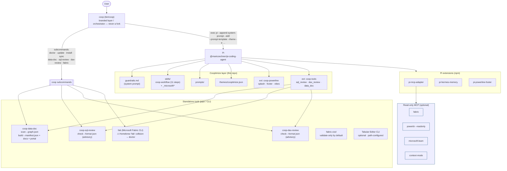

# Cooptimize Agent — Architecture

`coop` is a **branded layer on top of Pi** (`@mariozechner/pi-coding-agent`). It
is **not a fork**. `bin/coop` is a thin bash dispatcher that launches `pi` with
Cooptimize skills, prompts, theme, a governance system prompt, and companion
extensions, and shells out to the standalone Coop tools and the Microsoft Fabric
CLI. Everything Cooptimize-specific lives in this repo and is layered onto a
stock Pi install — so Pi can be updated underneath `coop` without merge pain.

## Layers

1. **`coop` (orchestrator).** `bin/coop` resolves `COOP_ROOT`, sources
   `lib/common.sh`, optionally runs an Azure / Power BI token preflight, then
   `exec pi …` with the branded resources attached. It also dispatches the
   subcommands (`doctor`, `update`, `install`/`bootstrap`, `sync`, `data-doc`,
   `sql-review`, `dax-review`, `fabric`, `version`, `help`) and aliases Pi
   management (`coop list/config/add/remove/pi`) so `coop` is the only command a
   user types. Any unknown subcommand or flag is passed straight through to `pi`.

2. **Pi (engine).** The actual coding agent: conversation loop, tool execution,
   sessions, MCP wiring, extension host. `coop` never modifies Pi; it configures
   it at launch via flags (`--append-system-prompt`, `--skill`,
   `--prompt-template`, `--theme`, `-e <extension>`).

3. **Cooptimize resources loaded into Pi at launch** (see `bin/coop` →
   `launch_pi`):
   - **Guardrails system prompt** — `docs/guardrails.md`, *appended* (not
     replacing Pi's prompt): read-only-first, plan-and-approve, never commit
     source, MCP read-only, never expose secrets.
   - **Skills** — `skills/`, including `coop-workflow` (the mandatory 11-step
     workflow) and a filtered set of official Microsoft agent skills under
     `skills/_microsoft/`.
   - **Prompt templates** — `prompts/`.
   - **Theme** — `themes/cooptimize.json` (brand palette: navy `#00416B`,
     forest `#42783C`, olive `#82AA43`, lime `#B2D235`, red `#EF412D`).
   - **`coop-powerline` extension** — `extensions/coop-powerline/`: brand splash
     (`assets/splash.ansi`), footer/status segments, and working "vibes"
     (`COOP_VIBES_DIR`, `COOP_SPLASH_FILE` are exported for it).
   - **`coop-tools` extension** — `extensions/coop-tools/`: registers the native
     LLM-callable tools `sql_review`, `dax_review`, `data_doc` that shell out to
     the standalone CLIs and return JSON the model reasons over.

4. **Pi extensions installed from npm** (`config/defaults.yml`):
   - `pi-mcp-adapter` — wires the read-only MCP servers.
   - `pi-hermes-memory` — persistent memory, session search, secret scanning.
   - `pi-powerline-footer` — branded footer/status bar.
   - Recommended: `pi-permissions` (tool-permission gating), `@aliou/pi-guardrails`.

5. **Standalone tools** (pipx, on PyPI) — invoked two ways: by the `coop`
   subcommands and by the native `coop-tools` extension, both via CLI with the
   exact contracts in [`tool-contract.md`](./tool-contract.md):
   - `coop-data-doc` — SQL + Power BI documentation and lineage.
     `scan` → `graph.json`; `build` → `manifest.json` + Markdown docs + portal.
   - `coop-sql-review` — advisory T-SQL standards linter
     (`check <paths> --format json`). Never edits or blocks.
   - `coop-dax-review` — advisory DAX standards linter (same shape).

6. **Microsoft platform tooling:**
   - **`fab`** — the Microsoft Fabric CLI (`ms-fabric-cli`). `coop fabric …` is a
     pass-through. NOTE: a Homebrew `fabric` formula ships a *different* `fab`
     (Python SSH / Paramiko) — a real `PATH` collision that `coop doctor`
     detects and warns about.
   - **`fabric-cicd`** — Fabric deployment validation, **validate-only by
     default**; deploy is an approval-gated action.
   - **Tabular Editor CLI** — optional, path-configured (mostly Windows), not
     auto-installed; set `tools.tabular_editor_cli.executable_path` in
     `.coop/project.yml`.

7. **Read-only MCP servers** (all optional; `coop` runs without them). Preloaded
   into `~/.config/mcp/mcp.json` by `coop sync` from `config/mcp.example.json`:
   - `fabric` — `@microsoft/fabric-mcp` (AzureCliCredential).
   - `powerbi` — `powerbi-mcp-server --readonly`.
   - `microsoft-learn` — `learn.microsoft.com/api/mcp` via `mcp-remote`
     (always-current Microsoft docs).
   - `context-mode` — local.

   `coop` **never** performs write/create/update/delete/deploy/publish MCP
   actions without explicit approval, regardless of server capability.

## Diagram

## Governance flow

Every task that touches SQL, DAX, Fabric objects, semantic models, reports, docs,
or lineage runs through the **`coop-workflow` 11-step skill**, enforced by the
`guardrails.md` system prompt: read context (`.coop/project.yml` + standards) →
scope and impact → read target + lineage (`data_doc`) → **PLAN + explicit
approval** → timestamped backup → smallest safe edit → review
(`sql_review` / `dax_review`, plus Tabular Editor BPA / `fabric-cicd` validate
where relevant) → diff + summarize → update docs/glossary/lineage and regenerate
the site → append to the daily log → **commit docs/logs/site only with approval;
never commit source**.

The project contract `.coop/project.yml` (copied from
`.coop/project.example.yml`) is the single source of truth for repo paths,
Fabric/Power BI workspaces, standards locations, backup/log rules,
allowed/blocked commit paths, and the approval policy.
