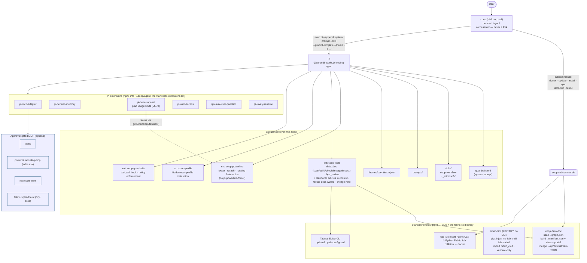

# Cooptimize Agent — Architecture

`coop` is a **branded layer on top of Pi** (`@earendil-works/pi-coding-agent`). It
is **not a fork**. `bin/coop.ps1` is a thin PowerShell dispatcher (launched by
`bin/coop.cmd`, or by the Git Bash forwarder `bin/coop`) that launches `pi` with
Cooptimize skills, prompts, theme, a governance system prompt, and companion
extensions, and shells out to the standalone Coop tools and the Microsoft Fabric
CLI. Everything Cooptimize-specific lives in this repo and is layered onto a
stock Pi install — so Pi can be updated underneath `coop` without merge pain.

## Isolation

coop runs Pi against its own agent dir (`~/.coop/agent`; override with
`COOP_AGENT_DIR`) via the `PI_CODING_AGENT_DIR` env var, so only Cooptimize's
curated extensions/settings/theme/MCP load — your personal `pi` (its extensions,
themes, splash) stays untouched. Your login (auth/models) is shared in from
`~/.pi/agent`; settings/extensions/MCP are isolated. Provisioned by
`coop install`/`coop sync`. Disable with `COOP_NO_ISOLATE=1` (`true`, `yes`, `on`).

One profile root (master plan S3). `COOP_DIR` is the **parent** of `.coop`: the
profile dir is `$COOP_DIR\.coop` (default `~/.coop`) and holds `config`,
`user.json`, `agent\`, `support\`, `standards\` and `devops\`. The agent dir Pi
actually loads is one chain everywhere: `PI_CODING_AGENT_DIR`, else
`COOP_NO_ISOLATE` truthy → `~/.pi/agent`, else `COOP_AGENT_DIR`, else
`<profile dir>\agent`. The helpers are `Get-CoopProfileDir` / `Get-CoopConfigFile` /
`Get-CoopUserProfileFile` / `Get-CoopPiAgentDir` / `Get-CoopEffectiveAgentDir` in
`lib/common.ps1`, `lib/coop_paths.py` for the Python scripts and `lib/paths.mjs`
for the Node tools and extensions; no script builds these paths inline.

## Layers

1. **`coop` (orchestrator).** `bin/coop.ps1` resolves `COOP_ROOT`, dot-sources
   `lib/common.ps1`, exports `PI_CODING_AGENT_DIR` to point Pi at coop's isolated
   agent dir (`~/.coop/agent`; see **Isolation** above), runs a **launch-time
   extension-skew preflight** (checks the Pi agent against every installed
   extension's `@earendil-works/pi-ai` requirement — aborts with clear guidance if
   the agent is too old for an installed extension, and auto-realigns a merely-stale
   extension tree; bypass with `COOP_SKIP_EXT_CHECK=1`), runs the **Azure sign-in
   preflight** (client tenant from the project's `fabric.tenant_id`, else
   `~/.coop/config` `azure.tenant_id`; checks the Fabric token, then the Power BI
   token; in an interactive console an authentication failure opens a bounded
   `az login --tenant <id>` with no question; any failure prints one line and the
   launch continues; a success is cached for 30 minutes in `<agent-dir>/.az-ok`;
   `COOP_SKIP_AZ=1` skips it), then `exec pi …` with the branded resources
   attached. It also dispatches the
   subcommands (`doctor`, `update`, `install`/`bootstrap`, `sync`, `data-doc`,
   `fabric`, `version`, `help`) and aliases Pi
   management (`coop list/config/add/remove/pi`) so `coop` is the only command a
   user types. Any unknown subcommand or flag is passed straight through to `pi`.

2. **Pi (engine).** The actual coding agent: conversation loop, tool execution,
   sessions, MCP wiring, extension host. `coop` never modifies Pi; it configures
   it at launch via flags (`--append-system-prompt`, `--skill`,
   `--prompt-template`, `--theme`, `-e <extension>`).

3. **Cooptimize resources loaded into Pi at launch** (see `bin/coop.ps1` →
   `Build-CoopPiArgs` / `coop launch-spec --json`):
   - **Guardrails system prompt** — `docs/guardrails.md`, *appended* (not
     replacing Pi's prompt): read-only-first, plan-and-approve, never commit
     source, MCP read-only, never expose secrets.
   - **Skills** — `skills/`, including `coop-workflow` (the principles-first
     Cooptimize workflow) that the task skills run inside: `data-doc-analysis`, `power-bi-impact-analysis`,
     `fabric-workspace-review`, `fabric-apps` (builds and deploys a Fabric App
     with Rayfin to the dev workspace), `daily-logger`, `setup-docs` (the in-agent
     coop-data-doc wizard driven via `ask-user-question` + coop-data-doc's
     non-interactive commands), and `git-helper` (drafts Conventional-Commits
     messages + PR descriptions from the diff — drafts only, never commits) —
     plus a subordinate, pinned official Microsoft skills catalog refreshed by
     `coop sync` and resolved locally at launch.
   - **Prompt templates** — `prompts/` (per task skill: `discovery`,
     `impact-analysis`, `semantic-model-review`, `fabric-architecture-review`,
     `setup-docs`, `daily-log`, `weekly-log`; plus workflow prompts `spec-first`,
     `annotate`, `handoff`, and `pr-description`).
   - **Theme** — `themes/cooptimize.json` (brand palette: navy `#00416B`,
     forest `#42783C`, olive `#82AA43`, lime `#B2D235`, red `#EF412D`).
   - **`coop-powerline` extension** — `extensions/coop-powerline/`: coop's OWN
     footer and splash, plus rotating feature tips and easter eggs (`COOP_VIBES_DIR`,
     `COOP_SPLASH_FILE` are exported for it). coop does **not** use a third-party
     powerline footer (pi-powerline-footer was removed: its welcome overlay
     couldn't be disabled, Nerd Font glyphs showed as `?`, and it duplicated the
     bar). The footer shows `⬢ Cooptimize · <branch>` on the left and
     `<model> · ctx N% · tokens · $cost · <plan usage limits>` on the right, in
     plain text + common Unicode (no Nerd Font glyphs). It surfaces other
     extensions' status text (e.g. pi-better-openai's plan usage limits /
     5h+7d windows) via `footerData.getExtensionStatuses()`, so everything is in
     one clean bar. The splash is the truecolor block-art Cooptimize logo
     (uniform-padded, width-robust; `assets/splash.ansi`).
   - **`coop-tools` extension** — `extensions/coop-tools/`: registers the native
     LLM-callable tools `data_doc`, `bpa_review` (Tabular Editor BPA), the
     governed `fabric_sql_query` fallback and `sql_impact` (`lib/sql_impact.py`:
     three fixed catalog queries for one object's dependents, references and
     columns on the contract's dev/test SQL target), which shell out and return
     JSON the model reasons over. SQL/DAX/semantic-model standards need no tool: at launch
     `lib/standards.mjs` resolves the active coop-standards wiki articles and the
     extension feeds them into every such task, and the agent self-checks its diff
     against them before presenting a change. `data_doc` takes
     a `command` (`scan` / `build` / `check` / `lineage`); `lineage <object>
     [depth]` returns one object's upstream/downstream + relationships as JSON
     from the built graph, so the agent grounds a change in real lineage instead
     of guessing. A `before_agent_start` hook injects an agent-visible,
     human-hidden (`display:false`) note — once per folder — telling the agent to
     consult that lineage **before** touching any SQL/DAX/semantic-model object;
     it stays silent when no built docs exist (the docs are an aid, not a gate).
     The same hook hands the agent the Warehouse target the project contract
     pins, so a simple read goes straight to `fabric-sqlendpoint` with the
     contract ids instead of rediscovering them (silent without a contract target).
     The extension also hosts the in-agent project contract wizard
     (`/setup-project` and the on-demand Start Here menu)
     plus the `coop-data-doc` setup wizard built on
     Pi's native dialogs (the on-demand `/setup-docs` command and the explicit
     *Document my data* `/start` action), since coop-data-doc's own
     questionary wizard can't be driven from a non-TTY child. The wizard drives
     coop-data-doc's authoritative questionnaire over its JSONL bridge, and
     coop-data-doc (the companion tool) owns `coop-data-doc.yml`: coop never
     writes that file itself. (The `setup-docs` skill + prompt reach the same
     questionnaire; terminal and in-agent setup both end at the same file.)
   - **`coop-profile` extension** — `extensions/coop-profile/`: injects the local
     Coop user profile (`user.json`, written by `coop onboard`) as a small hidden
     instruction at session start, so the agent addresses the member by name and
     in their preferred style without the profile ever appearing in the chat.
   - **`coop-guardrails` extension** — `extensions/coop-guardrails/`: **enforces**
     governance at runtime via a `tool_call` hook (blocks the agent committing
     source; confirms destructive commands). Complements the advisory
     `docs/guardrails.md` system prompt. Approval-required actions fail closed
     headlessly; enforcement exceptions block the affected call with a fixed reason.
     Optional audit/display failures remain best-effort. Command audit records use
     fixed classifications, not raw command arguments. Central and dynamic MCP
     wrappers use the same target/argument normalization for mutation, SQL and
     bounded session-grant checks. `COOP_NO_GUARDRAILS=1` disables.

4. **Pi extensions installed from npm** into coop's isolated agent dir
   (the `extensions` list of `config/release-manifest.json`, the one manifest,
   with their transitive dependencies in `config/extensions-lock.json`, which
   `coop sync` installs with `npm ci` so every machine on a release runs the same
   tree). One convergence path (master plan S2): `coop install` and `coop update`
   converge Pi, the pipx tools, the Fabric CLI and the npm authoring tools through
   the same `lib/common.ps1` functions (`Get-CoopFleetPlan` reads the manifest;
   `Invoke-CoopPiConverge` / `Invoke-CoopPipxConverge` /
   `Invoke-CoopFabricCliConverge` / `Invoke-CoopNpmToolConverge` probe, skip at
   the pin, else install) and leave the extensions to the `coop sync` child both
   run, where `Sync-CoopExtensionFleet` is the one `pi install` path (pins,
   lockfile, pi-ai/pi-tui alignment, postconditions). The extensions are:
   - `pi-mcp-adapter` — wires the managed MCP servers (Fabric and Microsoft
     Learn read-only; the rest approval-gated).
   - `pi-hermes-memory` — persistent memory, session search, secret scanning.
   - `pi-better-openai` — plan usage limits (5h / 7d windows), surfaced in
     coop's own footer via `footerData.getExtensionStatuses()`. `coop sync`
     pins its `footer.mode` to `status` (its `replace` default would wipe
     coop's footer).
   - `pi-web-access` — web search, URL fetch, GitHub clone, PDF/YouTube/video
     understanding (read-only; complements the Microsoft Learn MCP). A fresh
     session shows only its small `web_enable` tool; the model calls it to load
     the web tools when it needs them.
   - `@juicesharp/rpiv-ask-user-question` — lets the model put a structured,
     typed-option question to the user instead of guessing (fits consent rounds).
   - `@xl0/pi-lovely-rename` — names an unnamed session after three user turns
     (`/rename` regenerates; a manual `/name` always wins). The name shows in
     coop's footer and terminal title.

   The list is exactly the manifest's `extensions` object; nothing optional ships
   beside it. *(`@aliou/pi-guardrails` was dropped — pinned to the deprecated Pi
   and superseded by `coop-guardrails`. `context-mode` was dropped in U1: its
   `ctx_*` tools ran shell commands outside the guardrails' checks; `coop sync`
   removes it from existing installs.)*

   `pi-powerline-footer` is **not** used — coop renders its own footer/splash via
   `extensions/coop-powerline` (see layer 3).

5. **Standalone tools** (pipx, on PyPI) — invoked two ways: by the `coop`
   subcommands and by the native `coop-tools` extension, both via CLI with the
   exact contracts in [`tool-contract.md`](./tool-contract.md):
   - `coop-data-doc` — SQL + Power BI documentation and lineage.
     `scan` → `graph.json`; `build` → `manifest.json` + Markdown docs + portal;
     `lineage <object> [--depth]` → one object's up/downstream + relationships as
     JSON (read from the built graph). Degrades to non-interactive when run with
     no TTY (e.g. under the agent) — building everything that resolves rather than
     prompting — and exposes non-interactive twins of its wizard for agents/CI
     (`folders` / `set-folders`, `show-config` / `config-set`, `resolve` /
     `resolve-apply`).
   (`coop-sql-review` and `coop-dax-review` were retired in ST1: their rules now
   live in the coop-standards wiki articles coop writes against.)

6. **Microsoft platform tooling:**
   - **`fab`** — the Microsoft Fabric CLI (`ms-fabric-cli`). `coop fabric …` is a
     pass-through. NOTE: the Python `fabric` package ships a *different* `fab`
     (Python SSH / Paramiko) — a real `PATH` collision that `coop doctor`
     detects and warns about.
   - **`fabric-cicd`** — a Python **LIBRARY** (no CLI). coop installs it via
     `pipx inject ms-fabric-cli fabric-cicd` so `fabric_cicd` is importable in the
     Fabric CLI's environment; it's used in deployment scripts (`import
     fabric_cicd`, **validate-only by default**), NOT as a `fabric-cicd` command.
     `coop doctor` checks it's importable. Deploy is an approval-gated action.
   - **Tabular Editor CLI** — the cross-platform `te` CLI, optional and not
     auto-installed; found on `PATH` or through
     `tools.tabular_editor_cli.executable_path` in `.coop/project.yml`.

7. **Approval-gated MCP servers** (all optional; `coop` runs without them). Generated as
   manifest-pinned, COOP-managed entries in coop's isolated agent dir
   (`~/.coop/agent/mcp-adapter.json`) by `coop onboard` / `coop sync`:
   - `fabric` — `@microsoft/fabric-mcp` (AzureCliCredential).
   - `powerbi-modeling-mcp` — `@microsoft/powerbi-modeling-mcp --start --readwrite
     --accept-eula`, the only Power BI MCP. Reads run freely; the guardrail classifies
     each call's `request.operation` and asks before any edit (#159). (`powerbi-mcp-server`, the former `powerbi` entry, is
     retired: it ignores `--readonly` and exposes `refresh_dataset`, a write, #93.
     `coop sync` removes the entry it generated; `coop doctor` warns about a
     user-owned one.)
   - `azure-devops` — `@azure-devops/mcp <org>` (organization-gated).
   - `microsoft-learn` — `learn.microsoft.com/api/mcp`, a direct Streamable HTTP
     entry the adapter speaks itself (no bridge package)
     (always-current Microsoft docs).

   `coop` **never** performs write/create/update/delete/deploy/publish MCP
   actions without explicit approval, regardless of server capability.

8. **The coop window (`coop desktop`, master plan D1b).** A second front end
   over the same Pi, not a second agent. `coop desktop` runs the launch
   preflight, prints nothing new into Pi's arguments, and hands the window a
   launch spec (`coop desktop --print-spec` shows it): node, Pi's entry, the
   folder, and the exact `Build-CoopPiArgs` arguments and environment that
   `coop launch-spec --json` reports. The window (`desktop/`, Electron, loaded
   in place like the extensions) runs `node <pi entry> --mode rpc <args>` with
   no shell and draws Pi's RPC events: a timeline, the extension dialogs
   (every guardrail approval and wizard), pickers, sessions and four themes.
   Its renderer is sandboxed (context isolation, no Node, a strict CSP, only
   `coop://app` files) and reaches the main process through a fixed IPC list
   that rebuilds every RPC command field by field
   (`desktop/lib/rpc-commands.mjs`). It never passes `--approve`, so a work
   repo's own `.pi` files load only after a saved `/trust` decision, as in any
   non-interactive Pi mode. Electron is pinned in the release manifest
   (`desktop.electron`) and installed from `config/desktop-lock.json` into
   `~/.coop/desktop/runtime` on first use; the window's own settings live in
   `~/.coop/desktop/data`. Closing the window ends Pi and every process it
   started. The **coop window package** (master plan D1c) is the same `desktop/`
   code packed by electron-builder into an unsigned NSIS per-user installer
   (`desktop/installer/electron-builder.cjs`, staged by
   `desktop/scripts/build-installer.mjs`: `desktop/`, the `lib/*.mjs` modules it
   imports, the vibes, the splash and the icon in an asar, pdf.js and its reader
   script unpacked beside it, the September fuse policy applied). Started from
   its shortcut it has no spec, so it finds the terminal's `coop.cmd` the way
   `bin/coop-desktop.ps1` does and runs `coop desktop --app <its exe>`
   (`desktop/lib/bootstrap.mjs`); coop.ps1 starts the exe again with the spec,
   and that process hands it to the first through Electron's single-instance
   lock. Child processes cannot read an asar, so the package runs the standards
   reader on the terminal's checkout. `coop.exe --doctor` prints one JSON line
   and exits; the `installer (Windows)` CI job builds the installer, installs it
   silently, runs that and uninstalls (`desktop/scripts/verify-installer.mjs`). What only the terminal can show (model sign-in, `custom()` screens,
   `/trust`) opens the same session in a terminal; `desktop/PARITY.md` maps every
   Pi command, keybinding and extension command, and `tests/desktop.test.mjs`
   checks it against a recorded session.

   The window's side pane (master plan D1b2) adds views over what coop already
   has, never a second policy path: the folder's git diff, the standards
   `lib/standards-cli.mjs resolve-many` resolves, a form for
   `.coop/project.yml` and one for `/setup-docs`. Only the two forms write, and
   only through the code the terminal wizards use: `lib/project-contract.mjs`
   (the `/setup-project` writer, which keeps unowned fields and writes a
   backup) and `lib/data-doc-setup.mjs` (the driver for coop-data-doc's JSONL
   wizard, which stays the only writer of `coop-data-doc.yml`). The main
   process rebuilds every form answer from an allowlist with the wizard's own
   checks; `tests/desktop-panes.test.mjs` compares both forms with the wizards.

   Attachments follow the same rule: the window never hands the model a
   document itself. Images go with the prompt as Pi's own image content (as
   the terminal's paste does); text files are referenced by path; Word, Excel
   and PowerPoint files are read to Markdown by `desktop/lib/office.mjs` (a
   dependency-free zip and XML walk) and PDFs by pdf.js in a separate node
   process with a time limit (`desktop/scripts/pdf-text.mjs`; no rendering, no
   PDF JavaScript). The extract is saved under the window's data folder and
   referenced by path, so coop reads it through its guarded read tool and the
   session log records what it read. `pdfjs-dist` is the runtime's second
   pinned package (`desktop.pdfjs` in the manifest, `config/desktop-lock.json`).
   The timeline draws a run of assistant messages as one answer and folds the
   thinking and tool calls between two pieces of prose into one expandable
   line; the session file is untouched, only the view.

## Diagram

```mermaid
flowchart TD
    user([User]) --> coop["coop (bin/coop.ps1)\nbranded layer / orchestrator — never a fork"]

    coop -- "subcommands:\ndoctor · update · install · sync\ndata-doc · fabric" --> subs[[coop subcommands]]
    coop -- "exec pi --append-system-prompt --skill\n--prompt-template --theme -e …" --> pi["Pi\n@earendil-works/pi-coding-agent"]

    subgraph LAYER["Cooptimize layer (this repo)"]
      guard["guardrails.md\n(system prompt)"]
      skills["skills/\ncoop-workflow\n+ _microsoft/*"]
      prompts["prompts/"]
      theme["themes/cooptimize.json"]
      ext_pl["ext: coop-powerline\nfooter · splash · rotating feature tips\n(no pi-powerline-footer)"]
      ext_tools["ext: coop-tools\ndata_doc (scan/build/check/lineage/impact) · bpa_review\n+ standards articles in context · /setup-docs wizard · lineage note"]
      ext_profile["ext: coop-profile\nhidden user-profile instruction"]
      ext_guard["ext: coop-guardrails\ntool_call hook · policy enforcement"]
    end

    pi --> guard
    pi --> skills
    pi --> prompts
    pi --> theme
    pi --> ext_pl
    pi --> ext_tools
    pi --> ext_profile
    pi --> ext_guard

    subgraph PIEXT["Pi extensions (npm, into ~/.coop/agent; the manifest's extensions list)"]
      mcpad["pi-mcp-adapter"]
      mem["pi-hermes-memory"]
      bopenai["pi-better-openai\nplan usage limits (5h/7d)"]
      webacc["pi-web-access"]
      askq["rpiv-ask-user-question"]
      rename["pi-lovely-rename"]
    end
    pi --> PIEXT
    bopenai -. "status via getExtensionStatuses()" .-> ext_pl

    subgraph TOOLS["Standalone tools (pipx) — CLIs + the fabric-cicd library"]
      datadoc["coop-data-doc\nscan→graph.json\nbuild→manifest.json + docs + portal\nlineage <object>→up/downstream JSON"]
      fab["fab (Microsoft Fabric CLI)\n⚠ Python Fabric 'fab' collision → doctor"]
      cicd["fabric-cicd (LIBRARY, no CLI)\npipx inject ms-fabric-cli fabric-cicd\nimport fabric_cicd · validate-only"]
      te["Tabular Editor CLI\noptional · path-configured"]
    end
    subs --> datadoc
    subs --> fab
    ext_tools --> datadoc
    ext_tools --> te

    subgraph MCP["Approval-gated MCP (optional)"]
      fmcp["fabric"]
      pmcp["powerbi-modeling-mcp (edits ask)"]
      lmcp["microsoft-learn"]
      smcp["fabric-sqlendpoint (SQL asks)"]
    end
    mcpad --> MCP

    classDef ro fill:#eef,stroke:#00416B
    class MCP,fmcp,pmcp,lmcp,smcp ro
```

## Governance flow

Every task that touches SQL, DAX, Fabric objects, semantic models, reports, docs,
or lineage runs through the **`coop-workflow` skill** (principles-first), enforced by the
`guardrails.md` system prompt: read project context plus COOP's resolved standards
task authority (including any deliberate project override) →
scope and impact → read target + lineage (`data_doc`) → **PLAN + explicit
approval** → timestamped backup → smallest safe edit → self-check
(the diff against the same standards articles used to write it: fix what does not
meet them, deviate only on a user exception or a stated reason; plus Tabular Editor
BPA / `fabric-cicd` validate where relevant) →
diff + summarize → update docs/glossary/lineage and regenerate
the site → append to the daily log → **commit docs/logs/site only with approval;
never commit source**.

When the contract sets `logging.require_task_log: true`, `coop-tools` adds that
log step to every turn's system prompt as a non-skippable completion postcondition
for meaningful work. A quiet `tool_call`/`tool_result` tracker and
`agent_settled` check warn when substantive edits, reviews, or validation finish
without touching today's configured log; ordinary read-only Q&A is ignored.

The project contract `.coop/project.yml` (copied from
`.coop/project.example.yml`) is the source of truth for repo paths, Fabric/Power BI
workspaces, backup/log rules, allowed/blocked commit paths, and the approval policy.
It may provide deliberate project standards overrides; otherwise COOP's resolved
standards task authority is authoritative.
